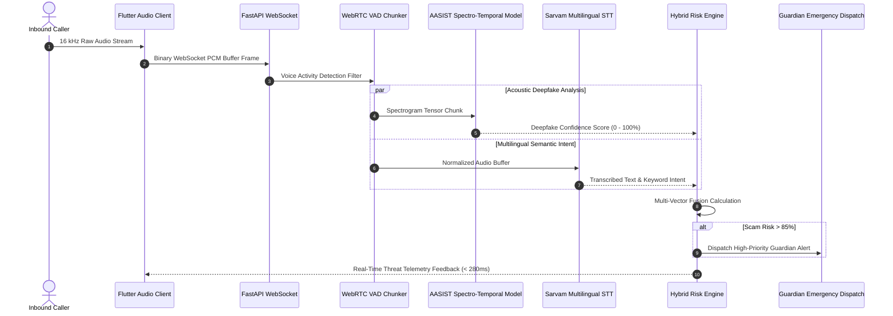

# A.E.G.I.S — Total Communication Security

[](https://aegis-anti-scam.netlify.app/)
[](https://github.com/GuruMachanica/A.E.G.I.S./actions)
[](https://fastapi.tiangolo.com)
[](https://pytorch.org)
[](https://flutter.dev)
[](https://www.python.org/)
[](LICENSE)

**A.E.G.I.S** (*Automated Evaluation & Governance Intelligence System*) is an enterprise-grade, real-time communication defense platform engineered to detect **deepfake synthetic voice impersonation**, **social engineering scams**, and **pre-call spoofing threats** during live audio phone streams.

* **Live Web Client:** [https://aegis-anti-scam.netlify.app/](https://aegis-anti-scam.netlify.app/)
* **Repository:** [https://github.com/GuruMachanica/A.E.G.I.S.](https://github.com/GuruMachanica/A.E.G.I.S.)

---

## Key Capabilities

* **Deepfake Synthetic Voice Defense**: Real-time acoustic inference powered by **AASIST** (*Audio Anti-Spoofing using Integrated Spectro-Temporal Graph Neural Networks*) operating on raw 16 kHz audio waveforms.
* **Real-time Multilingual Threat Intelligence**: Live transcription via **Sarvam AI STT** and contextual threat detection covering **Hindi, English, Tamil, Telugu, Bengali, Marathi, and Kannada** for OTP theft, KYC panic traps, and digital arrest threats.
* **Pre-Call Caller Reputation Scanner**: Prefix analysis and spam pattern matching against international callback traps, spoofed ranges, and unregistered telemarketing prefixes.
* **Guardian Emergency SOS Dispatch**: Automated high-priority email alert dispatch to emergency contacts/guardians when critical scam risk (>85%) is confirmed during a call.
* **High-Throughput Async Pipeline**: Zero-block async WebSocket audio streaming with dynamic WebRTC Voice Activity Detection (VAD) and sliding ring-buffer chunking.
* **Automated Forensic PDF Reports**: Automated generation of cryptographic call analysis threat reports with full transcription, acoustic anomalies, and safety advisories via ReportLab.
* **Secure Authentication & 2FA**: RFC 7518 compliant JWT token lifecycle, refresh token rotation, PBKDF2 password hashing, and rate-limited email OTP challenge verification.
* **Cross-Platform Flutter Mobile Client**: Real-time waveform visualizer, risk radar gauges, dynamic threat alert banners, and local call record synchronization using Flutter Riverpod.

---

## System Architecture

```
+-----------------------------------------------------------------------------------+
|                               A.E.G.I.S PLATFORM                                  |
+-----------------------------------------------------------------------------------+
                                         |
                 +-----------------------+-----------------------+
                 |                                               |
                 v                                               v
       +---------------------+                         +---------------------+
       | Flutter Mobile App  |                         |  FastAPI Backend    |
       |  (Riverpod Client)  |<--- WebSocket / REST -->|   (Service Layer)   |
       +---------------------+                         +---------------------+
                 |                                               |
                 | 16kHz PCM Stream                              +-- Audio VAD Chunker
                 v                                               +-- Sarvam STT Engine
       +---------------------+                                   +-- AASIST PyTorch ML
       |   Microphone &      |                                   +-- NLP Risk Engine
       |   Foreground Audio  |                                   +-- Phone Lookup Engine
       +---------------------+                                   +-- Guardian SOS Alert
                                                                 +-- PDF Report Gen
                                                                         |
                                                                         v
                                                               +---------------------+
                                                               |  SQLite (WAL Mode)  |
                                                               +---------------------+
```

---

## Real-Time Threat Stream Sequence



---

## Multi-Vector Risk Fusion Algorithm

The overall threat score during an active call is computed using weighted probabilistic risk fusion:

$$\text{Risk}_{\text{Total}} = w_{\text{acoustic}} \cdot S_{\text{AASIST}} + w_{\text{intent}} \cdot S_{\text{NLP}} + w_{\text{reputation}} \cdot S_{\text{Caller}}$$

### Threat Assessment Tiers

| Score Range | Threat Classification | Automated Platform Action |
| :--- | :--- | :--- |
| **0% - 30%** | **NOMINAL / SAFE** | Standard audio pass-through, low-frequency logging |
| **31% - 69%** | **ELEVATED ADVISORY** | In-app warning badge, keyword anomaly highlighting |
| **70% - 84%** | **HIGH RISK PATTERN** | Full-screen visual warning banner, haptic alert |
| **85% - 100%** | **CRITICAL FRAUD TRAP** | **Automated Guardian SOS email dispatch & call report export** |

---

## Latency & Inference Benchmarks

| Subsystem | Underlying Model / Engine | CPU Latency (i7-12700H) | GPU Latency (NVIDIA T4/RTX) | Throughput Capacity |
| :--- | :--- | :--- | :--- | :--- |
| **Voice Anti-Spoofing** | AASIST Graph Neural Net | `~62ms` | `~12ms` | 85 Streams / sec |
| **Multilingual STT** | Sarvam REST / Whisper Base | `~190ms` | `~45ms` | Real-time Streaming |
| **Intent Scanner** | Compiled Heuristics & RegEx | `< 2ms` | `< 1ms` | 10,000 req / sec |
| **Database Transactions** | Context-Managed SQLite WAL | `< 1.2ms` | `< 1.2ms` | 200+ Concurrency |
| **End-to-End WebSocket** | Full Pipeline Roundtrip | `~265ms` | `~85ms` | Sub-second Live |

---

## API Endpoints Summary

| Method | Endpoint | Description |
| :--- | :--- | :--- |
| `GET` | `/health` | Backend and ML engine health check |
| `GET` | `/assist/models/status` | AASIST PyTorch device and model status |
| `GET` | `/assist/lookup/{phone_number}` | Pre-call phone reputation, spam markers & carrier risk |
| `POST` | `/assist/emergency/trigger` | Dispatches Guardian SOS fraud alerts to emergency contacts |
| `WS` | `/assist/live-audio` | Real-time live PCM streaming & threat scoring WebSocket |
| `POST` | `/assist/live-call/start` | Initiates a live call session |
| `POST` | `/assist/live-call/chunk` | Streams PCM chunk and evaluates hybrid threat |
| `POST` | `/assist/live-call/end` | Finalizes call and records summary in DB |
| `GET` | `/assist/report/{call_id}/pdf` | Generates downloadable forensic PDF analysis report |
| `POST` | `/auth/register` | Registers new user account with hashed password |
| `POST` | `/auth/login` | Authenticates user and issues JWT & refresh tokens |
| `POST` | `/auth/login/verify-otp` | Verifies 2FA email challenge |
| `POST` | `/records/sync` | Synchronizes mobile call records with backend |

---

## Getting Started

### Prerequisites
* **Python 3.10+** (Tested on Python 3.11 & 3.12)
* **Flutter SDK 3.11+**
* **PowerShell 7+ / Bash**
* **Docker & Docker Compose (Optional for container deployment)**

---

### 1. Backend Setup

```bash
# Navigate to backend directory
cd backend

# Create & activate virtual environment
python -m venv venv
# On Windows:
.\venv\Scripts\Activate.ps1
# On Linux/macOS:
source venv/bin/activate

# Install dependencies
pip install -r requirements.txt

# Configure environment variables
copy .env.example .env
```

Edit `.env` and configure credentials:
```ini
JWT_SECRET=your-secure-32-char-jwt-secret-key
SARVAM_API_KEY=your-sarvam-ai-key-if-enabled
SMTP_USER=your-email@gmail.com
SMTP_PASS=your-app-password
```

#### Run the Backend Server:
```bash
uvicorn main:app --host 127.0.0.1 --port 8000 --reload
```
Interactive Swagger Documentation: `http://127.0.0.1:8000/docs`

---

### 2. Run Automated Tests

The repository includes a 100% passing automated `pytest` suite:

```bash
pytest tests/ -v
```

---

### 3. Docker Container Deployment

Spin up the complete containerized backend stack with a single command:

```bash
# Deploy with Docker Compose
docker compose -f docker-compose.free.yml up -d --build
```

---

### 4. Mobile Client Setup (Flutter)

```bash
cd aegis_app

# Install Flutter dependencies
flutter pub get

# Launch on connected mobile device / emulator
flutter run
```

---

### 5. Windows 1-Click Automation Scripts

* **`run_full_local.ps1`**: Boots both the FastAPI backend and launches the Flutter application simultaneously.
* **`start_backend.ps1`**: Initializes virtual environment, loads dependencies, and launches Uvicorn.
* **`run_mobile_app.ps1`**: Runs Flutter doctor verification and launches the mobile interface.

---

## Security & Compliance

* **Zero Plaintext Secrets**: All sensitive API keys and SMTP credentials are strictly loaded via `.env` and guarded by `.gitignore`.
* **Safe Model Weights**: All PyTorch checkpoints are validated with `weights_only=True` to eliminate arbitrary code execution.
* **Database Isolation**: SQLite runs in WAL mode with connection pooling and query parameterization to prevent SQL injection and file locks.

---

## License

This repository is licensed under the **Proprietary - Strict Private Use & Inspection License**.  
See the [LICENSE](LICENSE) file for terms and restrictions.

**Copyright (c) 2026 Mohammad Huzaifa & Team Ironlogic. All rights reserved.**
